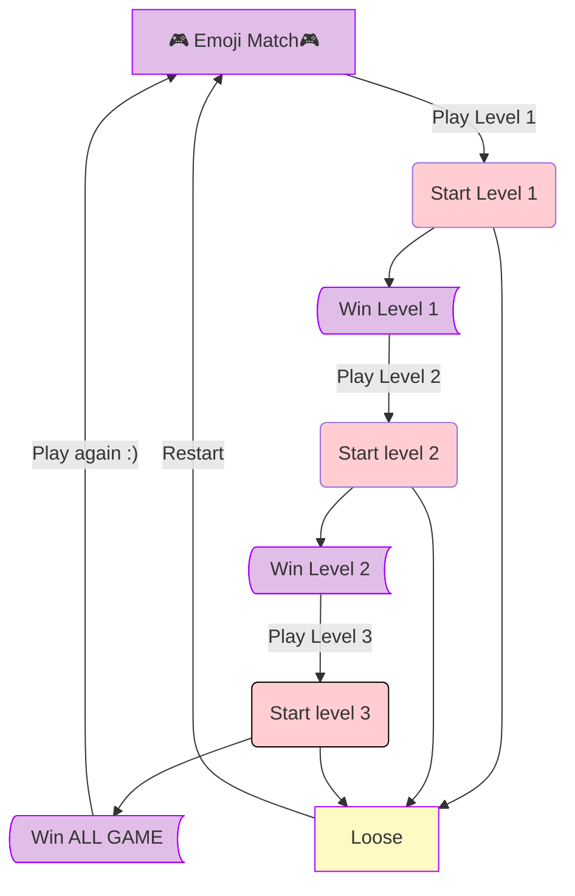

# ✅ Améliorations apportées :

### 1. Icones plus interactives
J'ai amélioré les icones suivantes : 🔊 🌙

J'ai choisi d'afficher 🔊 quand la musique joue, et 🔇 quand la musique est arrêtée ou en pause

Pareil pour l'icone mode nuit 🌙 qui se transforme en mode jour quand on clique dessus ☀️

Cela donne un feedback visuel clair à l’utilisateur. 

Diagramme : 

